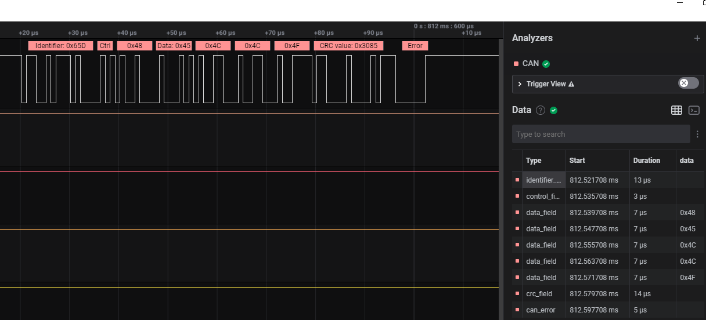

# Intro
- Simple CAN Bus working in NORMAL mode, auto-retranmision DISABLED, Bitrate = 1MHZ
# Run this
- Connect correctly with external CAN module (I used CJMCU-230, but other CAN modules would definitely work fine), and make sure 120Ohm resistor is present.
- Attach Logic Analyzer with PB9 (CAN_TX), and GND to see the CAN bus message.
- Run the code, you should see something as the below photo:
